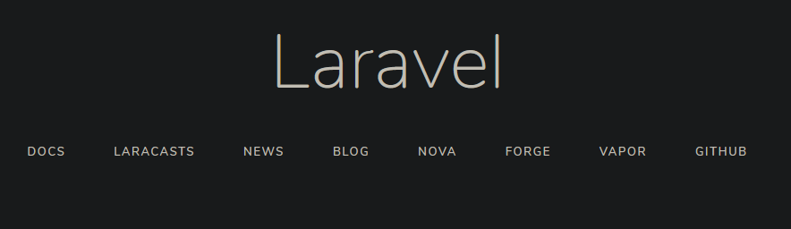
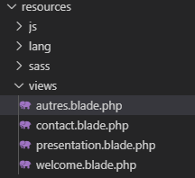
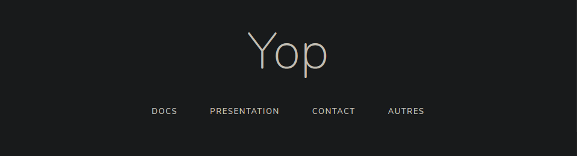
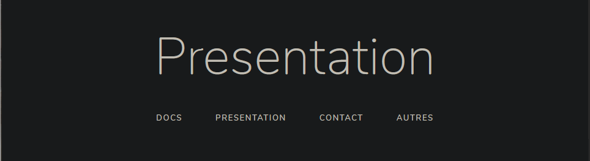
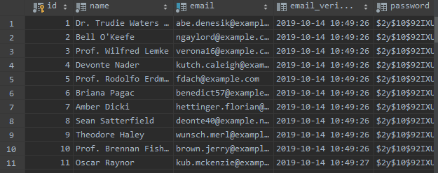
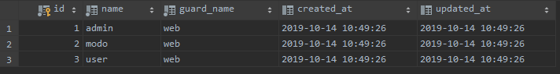

# Framework Laravel

## Séance 1: Installation de l'environnement de développement et création du premier projet.

### Mes prérequis

J'utilise: 
* PHPStrom comme IDE et pour visiualiser ma base de donnée
* PHP7
* Composer
* Uwamp pour le serveur web
* mysql que l'on relis à PHPStrom pour la base de donnée

### Créer son premier projet

* Création: 
`composer create-project --prefer-dist laravel/laravel [projet]`

* Lancement:
``` 
    pierre~>php artisan serve
    Laravel development server started: <http://127.0.0.1:8000>
```

Premier projet créé et lancé avec un premier visuel



* Connecter la base de données

Il faut modfier le fichier `.env`
``` PHP
    DB_CONNECTION=mysql
    DB_HOST=127.0.0.1
    DB_PORT=3306
    DB_DATABASE=laravel
    DB_USERNAME=root
    DB_PASSWORD=root
```

* Modification de la page d'accueil

La modification d'une page ce fait dans le dossier `ressource\views\`

Nous modifions `welcome.blade.php` qui est la page d'accueil et nous y ajoutons les routes vers de nouvelles pages que l'on vas créé

``` PHP
    <div class="content">
        <div class="title m-b-md">
            Yop
        </div>

        <div class="links">
            <a href="{{ url('/')}}">Docs</a>
            <a href="{{ url('/presentation')}}">Presentation</a>
            <a href="{{ route('contact' )}}">Contact</a>
            <a href="{{ route('autres' )}}">Autres</a>
        </div>
    </div>
```
Sans la prochaine étapes il y a un message d'erreur car nous n'avons pas encore définie les routes.

* Création de nouvelle page (Presentation/Contact/Autres)


Pour avoir de nouvelle page il suffit de créé des nouveaux fichiers dans le même dossier que `welcome.blade.php` avec l'exstension `.blade.php`



J'ai fait copier/coller de la page `welcome.blade.php` en changeant le titre

Ensuite il faut définir des routes vers ces pages dans `routes\web.php`

``` PHP
    <?php

    /*
    |--------------------------------------------------------------------------
    | Web Routes
    |--------------------------------------------------------------------------
    |
    | Here is where you can register web routes for your application. These
    | routes are loaded by the RouteServiceProvider within a group which
    | contains the "web" middleware group. Now create something great!
    |
    */

    Route::get('/', function () {
        return view('welcome');
    });
    Route::get('/contact', function () {
        return view('contact');
    })->name('contact');
    Route::get('/presentation', function () {
        return view('presentation');
    });
    Route::get('/autres', function () {
        return view('autres');
    })->name('autres');

```

Maintenant rafraichissons la page





* Créer un `UserTableSeeder` pour remplir la base de données de 100 utilisateurs

On utilise la commande ci-dssous, qui créera un fichier `database\seeds\UsersTableSeeder.php`

```
    pierre~> php artisan make:seeder UsersTableSeeder      
Seeder created successfully.
```

Nous rajoutons ensuite cette ligne dans notre fichier

`factory(App\User::class, 100)->create();`


UsersTableSeeder.php

``` PHP
    <?php

    use Illuminate\Database\Seeder;

    class UsersTableSeeder extends Seeder
    {
        /**
        * Run the database seeds.
        *
        * @return void
        */
        public function run()
        {
            factory(App\User::class, 100)->create();
        }
    }
```
Ne pas oublier de décomenter `$this->call(UsersTableSeeder::class);` dans `DatabaseSeeder.php`

Après modification on utilise la commande `composer autoload` pour généré nos utilisateur 

Vérification de la création des Users



## Séance 2

### Ajout des rôles

* Installer la librairie Spatie/permission en suivant la documentation

` composer require spatie/laravel-permission`

On ajoute la ligne ci-dessous dans `config/app.php`

` Spatie\Permission\PermissionServiceProvider::class`

On termine en publiant la migrations

` php artisan vendor:publish --provider="Spatie\Permission\PermissionServiceProvider" --tag="migrations"`

* Création d'un seeder: `RolesTableSeeder`

Pour créé un seeder et sont fichier on utilise la commande : 
`php artisan make:seeder RolesTableSeeder`

Le fichier `database/seeds/RolesTableSeeder.php` vient d'etre créé on y ajoute ensuite : `use Spatie\Permission\Models\Role;`


* Création de **User** avec un **Role**
* *    10 users Admin
* *    40 users Modo
* *    50 users User

``` PHP
    //Initialistion des Roles
    $role_admin = Role::where('name', 'admin')->first();
    $role_modo = Role::where('name', 'modo')->first();
    $role_user = Role::where('name', 'user')->first();

    //Création des Users avec un role
    //Admin
    factory(App\User::class, 10)->create()->each(function ($user) use ($role_admin) {
        $user->assignRole($role_admin);
    });

    //Modo
    factory(App\User::class, 40)->create()->each(function ($user) use ($role_modo) {
        $user->assignRole($role_modo);
    });

    //User
    factory(App\User::class, 50)->create()->each(function ($user) use ($role_user) {
        $user->assignRole($role_user);
    });
```
On vérifie la table `Role`



### Utiliser Middleware

* Créer trois contrôler qui portent le nom des trois rôles que vous avez créé

`php artisan make:controller adminController`
`php artisan make:controller modoController`
`php artisan make:controller userController`

* Créer trois vues que vous retournerez dans l'index de 3 controller (une vue par index de controller)

Dans chaque contoller la méthode **index** retourne la vue correspondant au role
```PHP
    public function index(){
            return view('[Role]');
        }
```

* Créer trois routes qui permettent d'accéder à ces 3 vues en fonction des 3 roles (un roles ne peut accéder qu'à une vue)

Chaque `route` appelle l'`index` du `controller` et vérifie si le `role` correspond à la page demandé.
```PHP
Route::get('/admin', 'adminController@index')->name('admin')->middleware('auth','role:admin');
Route::get('/modo', 'modoController@index')->name('modo')->middleware('auth','role:modo');
Route::get('/user', 'userController@index')->name('user')->middleware('auth','role:user');
```

